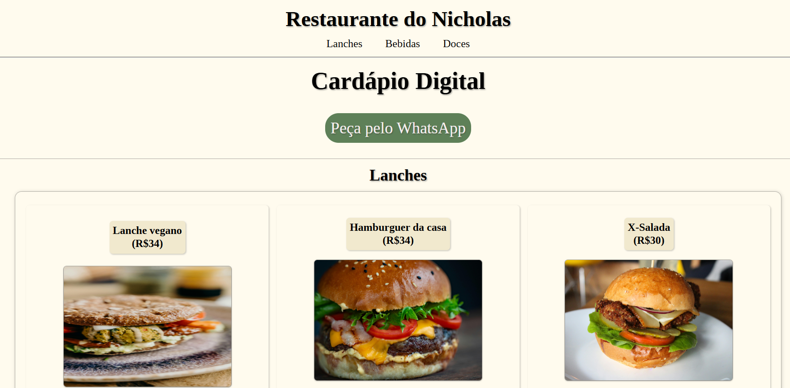
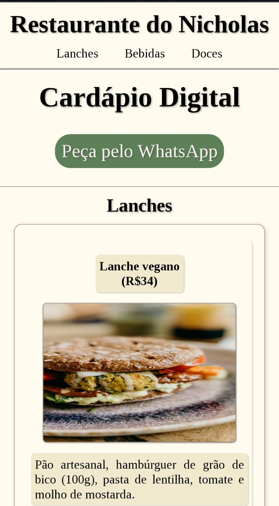

# Cardápio Digital — Restaurante do Nicholas

> Um cardápio digital simples, responsivo e acessível para restaurantes, lanchonetes e bares.

**Resumo (2–3 linhas):** Primeiro projeto pessoal focado em **HTML5/CSS** com abordagem **mobile‑first**. Testado em dispositivos reais (**Android** e **iPhone**) para garantir responsividade e acessibilidade. Resultado: uma página leve com **pedido via WhatsApp** e categorias de **Lanches, Bebidas e Doces**.

<p align="left">
  
  

</p>

---

## Links

* **Live Demo:** [https://nicholasrieger.github.io/Cardapio-Digital/](https://nicholasrieger.github.io/Cardapio-Digital/)
* **Repositório:** [https://github.com/NicholasRieger/Cardapio-Digital](https://github.com/NicholasRieger/Cardapio-Digital)

---

## Funcionalidades

* Categorias: **Lanches**, **Bebidas** e **Doces**.
* **Pedido via WhatsApp** com mensagem pré‑preenchida.
* Layout **mobile‑first** com **Flexbox**.
* Estilo personalizável via **variáveis CSS** (`:root`).
* Componentes em **cartões** com foco em legibilidade.

---

## Tecnologias

* **HTML5** e **CSS3** (sem frameworks)
* **Google Fonts** — família *Tinos*
* **Material Symbols** (ícones do Google)

---

## Estrutura do projeto

```text
Cardapio-Digital/
├─ index.html
├─ style.css
├─ imagens/
│  ├─ Lanches/
│  ├─ Bebidas/
│  └─ Doces/
└─ docs/
   └─ capturas.png
```

---

## Como executar localmente

**VS Code + Live Server**

1. Abra a pasta do projeto no VS Code.
2. Instale a extensão **Live Server** (Ritwick Dey).
3. Clique em **Go Live** e abra `index.html`.

---

## Configuração & Personalização

* **Nome do restaurante:** edite o `<h1>` no `index.html`.
* **WhatsApp:** atualize a URL em `#whatsapp` (formato `55DDDNUMERO`).
* **Cores e tema:** ajuste as variáveis em `:root` no `style.css`.
* **Itens e preços:** atualize textos e imagens nas seções `#lanches`, `#bebidas` e `#doces`.
* **Ícones/Fontes:** gerenciadas via links no `<head>` do `index.html`.

---

## Capturas

```md



```

---

## Acessibilidade & SEO

* HTML semântico (`<header>`, `<nav>`, `<main>`, `<section>`, `<footer>`).
* **Texto alternativo** (`alt`) nas imagens.
* **Meta description** definida no `<head>`.
* Tamanhos de toque confortáveis e boa hierarquia tipográfica.
---

## Performance

* **Cache busting** do CSS com versão na query string:

```html
<link rel="stylesheet" href="style.css?v=2">
```

* Otimize imagens (dimensões coerentes e compressão).

---

## Deploy no GitHub Pages

1. Mantenha `index.html` na **raiz** do repositório.
2. Vá em **Settings → Pages → Build and deployment**.
3. **Source:** *Deploy from a branch* → **Branch:** `main` → **/ (root)**.
4. Salve as alterações e aguarde a publicação.

---

## Roadmap

* [ ] Adicionar **Grid CSS** para versão desktop mais flexível.
* [ ] Implementar **Dark Mode** (`prefers-color-scheme`).
* [ ] Campo de **busca** por item e ancoragem por categoria.
---

## Contribuição

1. **Fork** do repositório
2. `git checkout -b feature/minha-feature`
3. `git commit -m "feat: descrição"`
4. `git push origin feature/minha-feature`
5. Abra um **Pull Request**

---

## Licença

Distribuído sob a licença **MIT**.

---

## Autor

**Nicholas Gabriel Rieger** — Aberto a feedbacks!
Issues e sugestões são bem‑vindas no repositório.

## Créditos

- **[Laura Pietra]** — QA: testou em iOS e Tablet, deu feedbacks de responsividade.
